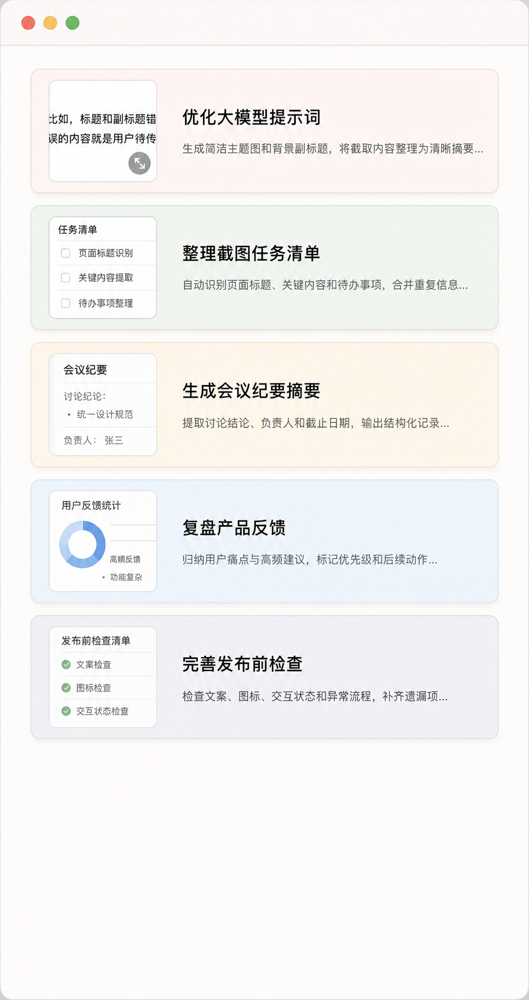
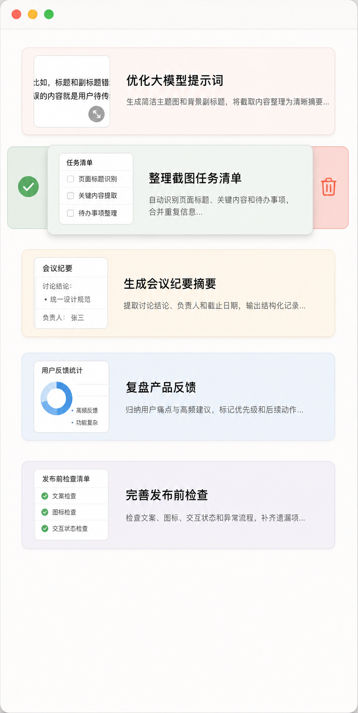
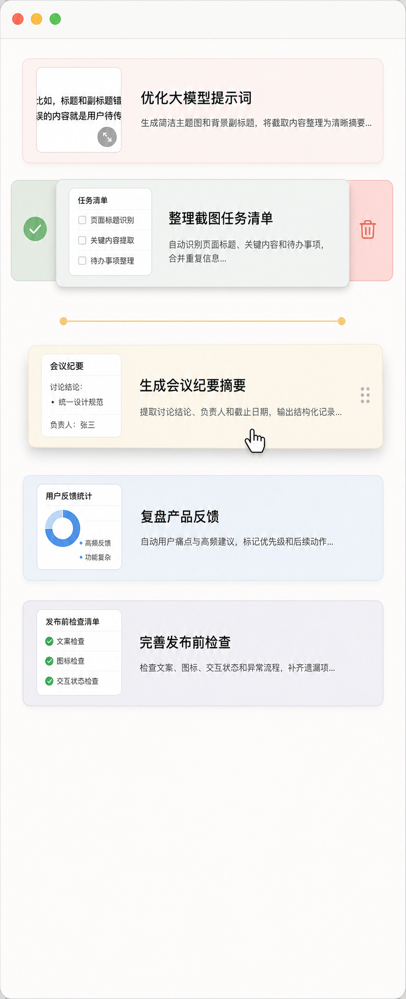
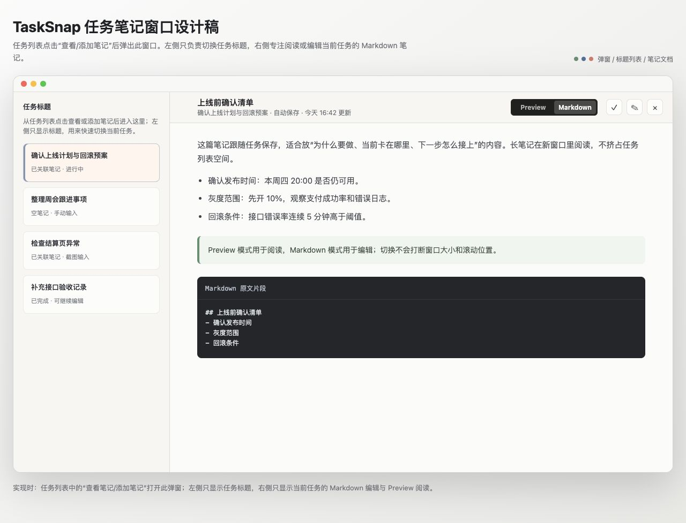

# TaskSnap

TaskSnap 是一个 macOS 桌面悬浮任务备忘录，面向经常在多个 AI 会话、网页、代码窗口和文档之间切换的人。

它的核心想法很简单：把当前上下文保存成一张可见的任务卡片。截图可以直接拖进来，TaskSnap 会用 OpenAI-compatible 视觉模型读图并生成待办标题；也可以手动创建文字任务。每个任务都能继续写 Markdown 笔记，方便把「稍后再处理」真正变成可以找回的工作现场。

中文名称：多任务并行备忘录



## 主要功能

### 截图变任务

- 支持拖入截图、图片文件，或在 TaskSnap 窗口内按 `Command-V` 粘贴剪贴板图片。
- 截图任务会自动进入任务列表顶部，并保留缩略图。
- 点击缩略图可以查看大图，快速回到当时的界面上下文。
- 配置视觉模型后，TaskSnap 会自动从截图中提炼任务标题和背景说明。



### AI 视觉摘要

TaskSnap 支持 OpenAI-compatible 的视觉模型接口。首次添加截图任务前，需要在设置窗口中填写：

- Endpoint
- API Key
- Model

保存配置时会先发起一次连通性测试。测试通过后，截图任务才会被接收并自动生成任务文案。接口地址可以填写服务根地址、`/v1` 地址或完整的 `/chat/completions` 地址，应用会自动补全为 Chat Completions 请求路径。

### 手动任务

不依赖模型也可以创建手动任务。点击任务列表顶部的 `+`，输入任务名称和描述即可。手动任务会使用随机浅色卡片和系统图标标记，适合记录没有截图上下文的临时事项。


### 轻量任务操作

- 点击任务文本打开对应任务笔记。
- 向右拖动任务卡片可标记完成。
- 向左拖动任务卡片可归档任务。
- 上下拖动任务卡片可重新排序。
- 右键任务卡片可通过菜单归档、标记完成或恢复进行中。
- `Command-Shift-Delete` 可归档已完成任务。



### 悬浮与折叠

TaskSnap 主窗口保持在桌面前方，并可加入所有 Space。窗口支持两种状态：

- 展开状态：显示完整任务列表。
- 折叠状态：变成一个 72x72 的圆形任务图标，并显示进行中任务数量。

在展开状态双击窗口顶部区域，或点击关闭按钮，会将窗口折叠而不是退出应用。折叠后点击图标即可重新展开。

### 任务笔记

每个任务都可以关联一份 Markdown 笔记。点击任务文本会打开独立的「任务笔记」窗口：

- 左侧按任务标题快速切换。
- 支持 Markdown 编辑和预览两种模式。
- 笔记自动保存到本地任务数据中。
- 预览模式支持标题大纲、代码块复制、链接样式和基础 Markdown 渲染。
- 顶部按钮可复制当前 Markdown 内容。



### 本地保存

TaskSnap 不依赖账号或云服务。任务和模型配置会保存到当前用户的 Application Support 目录：

- `~/Library/Application Support/TaskSnap/tasks.json`
- `~/Library/Application Support/TaskSnap/vision-model.json`

## 适合什么场景

- 同时让多个 AI 工具执行任务，需要记住每个会话的上下文。
- 调试、设计评审、文档整理等工作经常被中断，需要稍后回到现场。
- 想用截图代替冗长描述，把临时任务先收起来。
- 需要一个始终可见但不笨重的桌面待办面板。

## 开发运行

要求：

- macOS 14 或更新版本
- Swift 6.1 或更新版本

运行：

```bash
swift run TaskSnap
```

测试：

```bash
swift test
```

打包 DMG：

```bash
./scripts/package-dmg.sh v0.1.0
```

脚本会构建 release 版本，并在临时目录中生成 `TaskSnap-<version>.dmg`。

升级安装：

DMG 中包含 `Install.command`。升级时推荐双击运行它，脚本会覆盖安装到 `/Applications`、清除 macOS 下载隔离属性，并自动启动 TaskSnap。首次运行脚本时，如果 macOS 提示无法打开，请右键点击 `Install.command` 并选择「打开」。

如果手动拖拽 `TaskSnap.app` 到 `/Applications` 后仍遇到「无法验证开发者」提示，可以执行：

```bash
sudo xattr -dr com.apple.quarantine /Applications/TaskSnap.app
```

菜单栏图标诊断：

TaskSnap 启动后会出现在 macOS 菜单栏右侧。如果看不到图标，可以按顺序检查进程和隔离属性：

```bash
pgrep -fl TaskSnap
xattr -l /Applications/TaskSnap.app
sudo xattr -dr com.apple.quarantine /Applications/TaskSnap.app
open /Applications/TaskSnap.app
sleep 2
pgrep -fl TaskSnap
```

如果最后一行能看到 TaskSnap 进程，但菜单栏仍没有图标，可能是菜单栏图标过多或 MacBook 刘海区域导致系统隐藏了部分状态项。

## 技术栈

- Swift Package Manager
- SwiftUI
- AppKit window configuration
- Swift Testing
- OpenAI-compatible Chat Completions vision request

## 未来方向

- 全局快捷键快速显示或隐藏窗口。
- 自动识别截图中的窗口标题、网页标题或项目名。
- 按项目或工作流分组任务。
- 任务归档、搜索和历史回溯。
- 更完整的 Markdown 渲染能力。

## License

MIT
