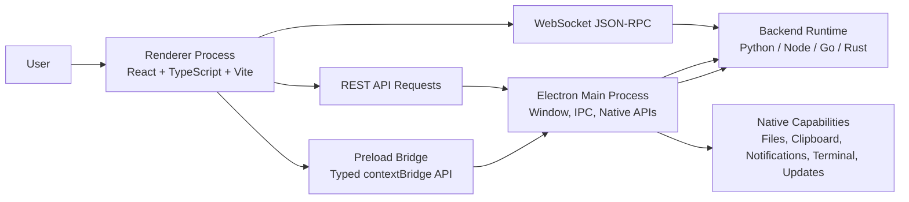
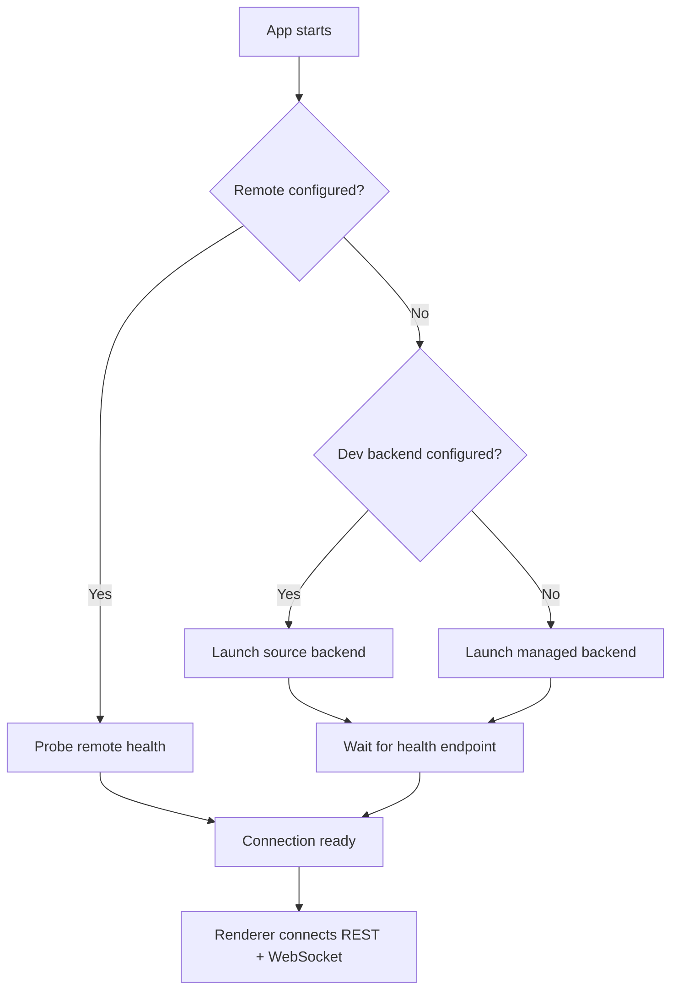
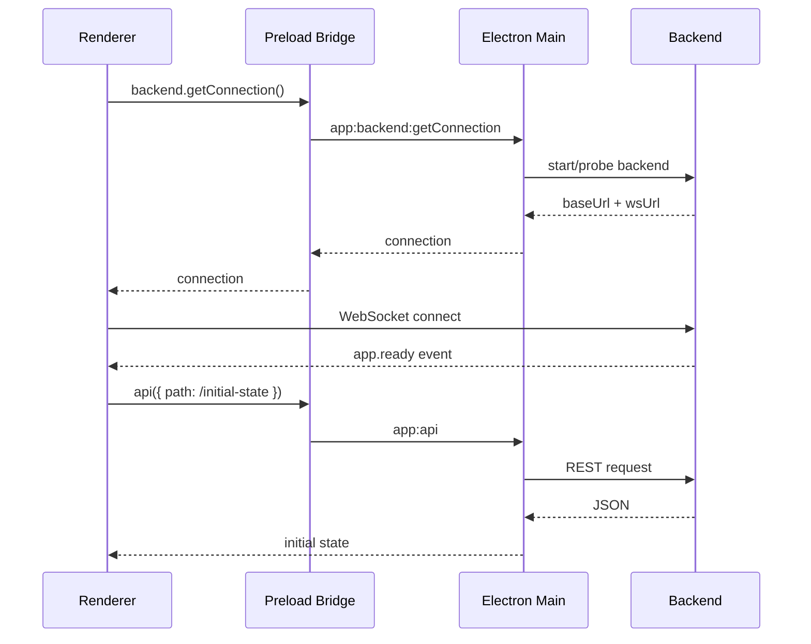

# Desktop App Technology Stack and Architecture

## 1. Goal

This document defines a reusable desktop application technology stack for projects that need a native desktop shell, a modern web-based UI, local or remote backend integration, real-time events, and optional native capabilities such as file access, notifications, and embedded terminals.

The stack is designed for cross-platform desktop apps on macOS, Windows, and Linux.

## 2. High-Level Architecture



The desktop app is split into four main layers:

| Layer | Responsibility | Suggested Technology |
|---|---|---|
| Main process | Window lifecycle, backend process management, native integrations, IPC handlers | Electron + Node.js |
| Preload bridge | Secure API surface exposed to the renderer | Electron `contextBridge` |
| Renderer | User interface, routing, state, API clients, realtime event handling | React + TypeScript + Vite |
| Backend | Business logic, data access, long-running tasks, realtime stream source | Python / Node / Go / Rust |

## 3. Core Technology Stack

### Desktop Runtime

- **Electron** for the cross-platform native desktop shell.
- **Electron Builder** for macOS, Windows, and Linux packaging.
- **Node.js** in the Electron main process for process management and native APIs.

### Renderer UI

- **React** for UI composition.
- **TypeScript** for type-safe application code.
- **Vite** for fast local development and production bundling.
- **React Router** using hash-based routing for packaged desktop compatibility.
- **TanStack React Query** for server-state fetching, caching, invalidation, and retries.
- **Nanostores** for lightweight shared client state.
- **Tailwind CSS** or a project-specific design system for styling.

### Backend Communication

- **REST** for request/response operations such as settings, lists, metadata, CRUD actions, and file-like payloads.
- **WebSocket JSON-RPC** for realtime events, streaming output, background task progress, and bidirectional commands.
- **Electron IPC** only for renderer-to-main native capabilities, not as the general business API.

### Optional Native Modules

- **xterm.js** in the renderer for an embedded terminal UI.
- **node-pty** in the main process for shell/PTY sessions.
- Native notifications through Electron `Notification`.
- Native file dialogs through Electron `dialog`.
- Clipboard integration through Electron `clipboard`.
- External link handling through Electron `shell.openExternal`.

## 4. Recommended Repository Structure

```txt
desktop-app/
├── package.json
├── vite.config.ts
├── tsconfig.json
├── index.html
├── electron/
│   ├── main.cjs              # Electron main process
│   ├── preload.cjs           # Secure renderer bridge
│   ├── backend.cjs           # Backend start/probe/restart helpers
│   ├── terminal.cjs          # Optional PTY integration
│   ├── updater.cjs           # Optional update flow
│   └── hardening.cjs         # Security policies and helpers
├── src/
│   ├── main.tsx              # React entrypoint
│   ├── app/
│   │   ├── index.tsx
│   │   ├── routes.ts
│   │   ├── shell/
│   │   ├── settings/
│   │   └── terminal/
│   ├── bridge/
│   │   ├── desktop-api.ts    # Typed wrapper around window.desktop
│   │   └── json-rpc-client.ts
│   ├── store/
│   ├── lib/
│   ├── components/
│   ├── types/
│   └── global.d.ts
└── shared/
    └── json-rpc-client.ts    # Optional shared transport package
```

## 5. Process Responsibilities

### 5.1 Electron Main Process

The main process should own:

- Application window creation.
- Security settings for all browser windows.
- Backend process startup and health checks.
- Backend restart and recovery.
- REST proxying when the renderer should not own authentication details.
- Native features: file dialogs, clipboard, notifications, external links, PTY sessions.
- OS-specific behavior.
- App packaging and update hooks.

The main process should not own UI state or business rendering logic.

### 5.2 Preload Bridge

The preload bridge exposes a narrow, typed API to the renderer.

It should:

- Use `contextBridge.exposeInMainWorld`.
- Validate or normalize untrusted renderer inputs before forwarding when possible.
- Return promises for async native operations.
- Hide Electron and Node internals from the renderer.

It should not expose raw `ipcRenderer`, `require`, filesystem APIs, child process APIs, or unrestricted shell execution.

### 5.3 Renderer Process

The renderer should own:

- React UI.
- Client routing.
- UI state.
- REST API client wrappers.
- WebSocket JSON-RPC client.
- Realtime event handling.
- Boot, reconnect, and error overlays.

The renderer should not directly access Node.js APIs.

### 5.4 Backend Runtime

The backend should own:

- Domain logic.
- Persistent data.
- Long-running jobs.
- Model or service integrations.
- Auth/session validation.
- REST routes.
- WebSocket JSON-RPC event stream.

The backend can be implemented in Python, Node.js, Go, Rust, or another runtime. The desktop shell should only depend on a stable backend contract: health endpoint, REST API, and WebSocket URL.

## 6. Security Baseline

Every BrowserWindow should use the secure defaults below:

```js
webPreferences: {
  preload: path.join(__dirname, 'preload.cjs'),
  contextIsolation: true,
  nodeIntegration: false,
  sandbox: true,
  webSecurity: true
}
```

Required rules:

1. Do not enable `nodeIntegration` in the renderer.
2. Do not expose raw Electron IPC to the renderer.
3. Do not let remote content run with privileged APIs.
4. Use `shell.openExternal` only after URL validation.
5. Keep backend authentication details out of normal UI components.
6. Treat every IPC payload as untrusted input.
7. Use a strict allow-list for IPC channels.
8. Keep the preload bridge small and typed.

## 7. Typed Preload API

A generic bridge can be exposed as `window.desktop`.

```ts
export interface DesktopBridge {
  backend: {
    getConnection: () => Promise<BackendConnection>
    restart: () => Promise<{ ok: boolean }>
  }

  api: <T>(request: ApiRequest) => Promise<T>

  files: {
    readText: (filePath: string) => Promise<{ text: string }>
    select: (options?: SelectPathsOptions) => Promise<string[]>
  }

  clipboard: {
    writeText: (text: string) => Promise<boolean>
  }

  native: {
    openExternal: (url: string) => Promise<void>
    notify: (payload: NativeNotification) => Promise<boolean>
  }

  terminal?: {
    start: (options?: TerminalStartOptions) => Promise<TerminalSession>
    write: (id: string, data: string) => Promise<boolean>
    resize: (id: string, size: { cols: number; rows: number }) => Promise<boolean>
    dispose: (id: string) => Promise<boolean>
    onData: (id: string, callback: (payload: string) => void) => () => void
    onExit: (id: string, callback: (payload: TerminalExit) => void) => () => void
  }
}

export interface BackendConnection {
  baseUrl: string
  wsUrl: string
  token?: string
  authMode?: 'token' | 'oauth' | 'none'
}

export interface ApiRequest {
  path: string
  method?: 'GET' | 'POST' | 'PATCH' | 'PUT' | 'DELETE'
  body?: unknown
  timeoutMs?: number
}

export interface SelectPathsOptions {
  directories?: boolean
  files?: boolean
  multiple?: boolean
}

export interface NativeNotification {
  title: string
  body: string
  silent?: boolean
}

export interface TerminalStartOptions {
  cwd?: string
  cols?: number
  rows?: number
}

export interface TerminalSession {
  id: string
  cwd: string
  shell: string
}

export interface TerminalExit {
  code: number | null
  signal: string | null
}
```

Renderer global declaration:

```ts
export {}

declare global {
  interface Window {
    desktop: DesktopBridge
  }
}
```

## 8. Preload Implementation Pattern

```js
const { contextBridge, ipcRenderer } = require('electron')

contextBridge.exposeInMainWorld('desktop', {
  backend: {
    getConnection: () => ipcRenderer.invoke('app:backend:getConnection'),
    restart: () => ipcRenderer.invoke('app:backend:restart')
  },

  api: request => ipcRenderer.invoke('app:api', request),

  files: {
    readText: filePath => ipcRenderer.invoke('app:files:readText', filePath),
    select: options => ipcRenderer.invoke('app:files:select', options)
  },

  clipboard: {
    writeText: text => ipcRenderer.invoke('app:clipboard:writeText', text)
  },

  native: {
    openExternal: url => ipcRenderer.invoke('app:native:openExternal', url),
    notify: payload => ipcRenderer.invoke('app:native:notify', payload)
  },

  terminal: {
    start: options => ipcRenderer.invoke('app:terminal:start', options),
    write: (id, data) => ipcRenderer.invoke('app:terminal:write', id, data),
    resize: (id, size) => ipcRenderer.invoke('app:terminal:resize', id, size),
    dispose: id => ipcRenderer.invoke('app:terminal:dispose', id),
    onData: (id, callback) => {
      const channel = `app:terminal:${id}:data`
      const listener = (_event, payload) => callback(payload)
      ipcRenderer.on(channel, listener)
      return () => ipcRenderer.removeListener(channel, listener)
    },
    onExit: (id, callback) => {
      const channel = `app:terminal:${id}:exit`
      const listener = (_event, payload) => callback(payload)
      ipcRenderer.on(channel, listener)
      return () => ipcRenderer.removeListener(channel, listener)
    }
  }
})
```

## 9. REST Proxy Pattern

Use the main process as a narrow REST proxy when authentication, cookies, or local backend routing should not be handled directly by UI components.

```js
ipcMain.handle('app:api', async (_event, request) => {
  const connection = await ensureBackend()
  const url = `${connection.baseUrl}${request.path}`

  const response = await fetch(url, {
    method: request.method || 'GET',
    headers: {
      'content-type': 'application/json',
      ...(connection.token ? { authorization: `Bearer ${connection.token}` } : {})
    },
    body: request.body === undefined ? undefined : JSON.stringify(request.body),
    signal: AbortSignal.timeout(request.timeoutMs || 30_000)
  })

  if (!response.ok) {
    throw new Error(`API ${response.status}: ${await response.text()}`)
  }

  return response.json()
})
```

Renderer wrapper:

```ts
export function api<T>(request: ApiRequest): Promise<T> {
  return window.desktop.api<T>(request)
}
```

## 10. WebSocket JSON-RPC Pattern

Use WebSocket JSON-RPC for realtime state and streaming events.

Recommended event categories:

- `app.ready`
- `task.started`
- `task.progress`
- `task.completed`
- `task.failed`
- `message.delta`
- `message.completed`
- `notification.created`
- `status.updated`
- `error`

Client responsibilities:

- Connection timeout.
- Request timeout.
- Pending request cleanup.
- State transitions: `idle`, `connecting`, `open`, `closed`, `error`.
- Event subscriptions by type and wildcard.
- Reconnect after sleep/wake or backend restart.

Minimal client interface:

```ts
export interface RpcEvent<P = unknown> {
  type: string
  payload?: P
}

export interface JsonRpcClient {
  connectionState: 'idle' | 'connecting' | 'open' | 'closed' | 'error'
  connect(wsUrl: string): Promise<void>
  close(): void
  request<T>(method: string, params?: Record<string, unknown>, timeoutMs?: number): Promise<T>
  on<P = unknown>(type: string, handler: (event: RpcEvent<P>) => void): () => void
  onAny(handler: (event: RpcEvent) => void): () => void
}
```

## 11. Backend Startup Pattern

The main process should support at least three backend modes:

1. **Development backend**: launched from a source checkout.
2. **Managed local backend**: installed with the app or under the user's app data directory.
3. **Remote backend**: configured by URL and token/OAuth.

Generic startup flow:



Backend connection descriptor:

```ts
export interface BackendConnection {
  baseUrl: string
  wsUrl: string
  token?: string
  authMode?: 'token' | 'oauth' | 'none'
}
```

Health endpoint response should include enough information for the renderer to connect:

```json
{
  "ok": true,
  "wsUrl": "ws://127.0.0.1:4317/ws",
  "version": "1.0.0"
}
```

## 12. Renderer Boot Flow

Renderer boot should be explicit and recoverable.



UI states:

- `booting`
- `connecting`
- `ready`
- `reconnecting`
- `failed`
- `reauth-required`

The app should show a boot overlay until initial connection and required state have loaded.

## 13. Reconnect Strategy

Desktop apps must handle sleep/wake, network changes, backend restarts, and laptop lid close/open.

Recommended behavior:

1. Detect WebSocket close.
2. Mark UI as reconnecting without destroying current state.
3. Re-probe backend connection.
4. Re-mint WebSocket URL if auth tickets are single-use.
5. Reconnect with exponential backoff.
6. Refresh important server state after reconnect.
7. Surface re-authentication errors once per disconnect episode.

Backoff example:

```ts
const delay = Math.min(15_000, 1_000 * 2 ** Math.min(attempt, 4))
```

## 14. Optional Embedded Terminal

Use this only for developer tools, automation consoles, local shells, or task output that benefits from a real terminal.

Renderer:

- `xterm.js`
- `@xterm/addon-fit`
- `@xterm/addon-web-links`
- optional WebGL renderer

Main:

- `node-pty`
- one PTY process per terminal session
- IPC channels for `data`, `write`, `resize`, `exit`, and `dispose`

Terminal IPC shape:

```ts
terminal: {
  start(options): Promise<{ id: string; cwd: string; shell: string }>
  write(id, data): Promise<boolean>
  resize(id, { cols, rows }): Promise<boolean>
  dispose(id): Promise<boolean>
  onData(id, callback): () => void
  onExit(id, callback): () => void
}
```

Security rule: terminal access should be explicit and user-visible. Do not use terminal APIs as a hidden command execution backdoor.

## 15. Packaging

Use `electron-builder` for cross-platform distribution.

Recommended targets:

| Platform | Targets |
|---|---|
| macOS | `dmg`, `zip` |
| Windows | `nsis`, `msi` |
| Linux | `AppImage`, `deb`, `rpm` |

Native dependencies require unpacking from ASAR:

```json
"asarUnpack": [
  "**/*.node",
  "**/prebuilds/**"
]
```

Recommended build fields:

```json
{
  "build": {
    "appId": "com.example.desktop",
    "productName": "Example Desktop",
    "artifactName": "Example-${version}-${os}-${arch}.${ext}",
    "directories": {
      "output": "release"
    },
    "files": [
      "dist/**",
      "electron/**",
      "assets/**",
      "package.json"
    ],
    "asar": true,
    "asarUnpack": [
      "**/*.node",
      "**/prebuilds/**"
    ],
    "mac": {
      "category": "public.app-category.developer-tools",
      "hardenedRuntime": true,
      "target": ["dmg", "zip"]
    },
    "win": {
      "target": ["nsis", "msi"]
    },
    "linux": {
      "category": "Development",
      "target": ["AppImage", "deb", "rpm"]
    }
  }
}
```

## 16. Development Scripts

Recommended package scripts:

```json
{
  "scripts": {
    "dev": "concurrently -k \"npm:dev:renderer\" \"npm:dev:electron\"",
    "dev:renderer": "vite --host 127.0.0.1 --port 5174",
    "dev:electron": "wait-on http://127.0.0.1:5174 && cross-env DESKTOP_DEV_SERVER=http://127.0.0.1:5174 electron .",
    "build": "tsc -b && vite build",
    "start": "npm run build && electron .",
    "pack": "npm run build && electron-builder --dir",
    "dist": "npm run build && electron-builder",
    "dist:mac": "npm run build && electron-builder --mac",
    "dist:win": "npm run build && electron-builder --win",
    "dist:linux": "npm run build && electron-builder --linux AppImage deb rpm",
    "typecheck": "tsc -p . --noEmit",
    "lint": "eslint src/ electron/"
  }
}
```

## 17. Vite Configuration

```ts
import { defineConfig } from 'vite'
import react from '@vitejs/plugin-react'
import path from 'node:path'

export default defineConfig({
  base: './',
  plugins: [react()],
  resolve: {
    alias: {
      '@': path.resolve(__dirname, './src')
    },
    dedupe: ['react', 'react-dom']
  },
  server: {
    host: '127.0.0.1',
    port: 5174,
    strictPort: true
  },
  preview: {
    host: '127.0.0.1',
    port: 4174
  },
  build: {
    chunkSizeWarningLimit: 25000
  }
})
```

For packaged desktop apps, prefer `base: './'` so local file loading works correctly.

## 18. State Management Pattern

Use two kinds of state:

1. **Server state** through React Query.
   - API responses.
   - Cached lists.
   - Settings fetched from backend.
   - Mutations and invalidation.

2. **Client state** through Nanostores or another lightweight atom store.
   - Active route/session/project.
   - Current connection state.
   - UI layout.
   - Sidebar/panel state.
   - Drafts and local-only preferences.

Avoid large monolithic hooks that own unrelated behavior. Prefer small feature-owned stores and hooks.

## 19. Error Handling

Required user-facing error surfaces:

- Boot failure overlay.
- Backend unavailable state.
- Reconnect banner or toast.
- Re-authentication required state.
- API mutation failure toast.
- Native capability unavailable message.
- Terminal unavailable message when PTY support is missing.

Do not crash the entire renderer for recoverable backend or network errors.

## 20. Reusable Template Contract

A project adopting this stack should define these project-specific contracts:

### Backend contract

- Health endpoint.
- REST API base path.
- WebSocket path.
- Auth mode.
- Initial state endpoint.
- Realtime event names.

### Desktop contract

- Product name.
- App ID.
- Icon assets.
- Backend launch command.
- User data location.
- Update strategy.
- Optional native features.

### Renderer contract

- Routes.
- Shell layout.
- Boot screen.
- Settings screens.
- Event handlers.
- API wrappers.

## 21. What to Reuse Across Projects

Reusable without business coupling:

- Electron secure window creation.
- Preload bridge pattern.
- Typed `window.desktop` API.
- Backend process manager.
- REST proxy.
- WebSocket JSON-RPC client.
- Reconnect/backoff strategy.
- Boot/error overlay pattern.
- xterm.js + node-pty terminal module.
- electron-builder packaging setup.

Project-specific and should not be hardcoded into the template:

- Business event names.
- Domain data types.
- Auth provider details.
- Backend command names.
- Product branding.
- Settings schema.
- Update server.
- Any project-specific routes or workflows.

## 22. Recommended Baseline Decision

Use this stack when the project needs:

- A cross-platform native desktop app.
- A rich React-based UI.
- A local backend runtime or remote backend option.
- Realtime task progress or streaming events.
- Native desktop capabilities.
- Packaged installers for macOS, Windows, and Linux.

Avoid this stack when the app is only a simple static UI, only needs browser deployment, or does not need native desktop integration. In those cases, a normal web app is simpler and cheaper to maintain.
